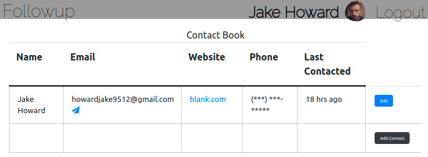

# Followup 

## A contact organization tool specially designed for freelance, job searching, and creative self-marketing

# Why?

## As a person sending emails to 20+ contacts on the daily there should be a clear and simple place to keep track of the people you have emailed and how long it has been since they have been in contact.

## Features

- Add contacts
- Set when you last contacted them
- Email using links in the table

# Technologies Used 📠
- CSS
- Javascript 
- React
- HTML
- Node.js
- Express
- MongoDb
- Mongoose
- Google Firebase Authorization
- Netifly 
- Heroku

# Furure Enhancements
- Auto update "last contacted" data using an email API
- Personalized Notifications
- Notes Section

# Getting Started

Go [here](https://followup-1.netlify.app/) and login through your Google account